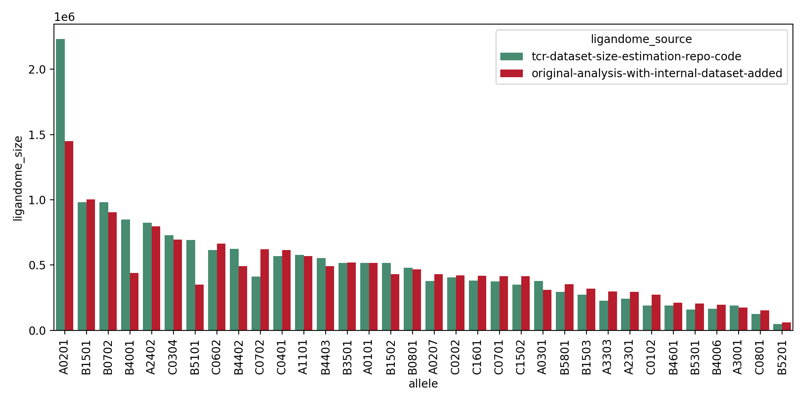

# Expanded Experimental Ligandome Workflow

This publication combines several public databases with a large internal dataset in order to estimate ligandomes for 34 MHC I alleles. Included in this repo are instructions to recreate the **workflow** described in the paper with **public data only**. While this workflow will not reproduce the exact results in the paper due to missing peptides from our internal dataset and different versions of public databases, it will produce estimates of a similar magnitude from public databases and the human proteome, supporting the conclusions of the work. Below, we compare:

- Total experimental ligandome sizes from the publication calculated using public databases as of 2023-08-29 and a large internal dataset (red).
- Total experimental ligandome sizes calculated using public databases only as of 2024-07-10 (green).



Public databases are constantly updated, and due the creation of a synthetic mutanome from each peptide during our analysis, a small number of added experimental peptides can result in very large increases in total experimental ligandome size. Hence, while most ligandomes are smaller (due to the lack of internal data), some are much larger (e.g. A0201). These changes have little effect on the overall dominating set sizes and therefore conclusions of the paper.

# Dependencies

## 1. Public database exports

**We do not distribute public databases with this work**. Please find instructions on how to populate the `ligandome/database_exports/` folder in the `database_collection` folder. This must be done prior to running the ligandome analysis.

## 2. NetMHCPan 4.1 install

To run scoring with NetMHCPan 4.1 you must [obtain a copy for academic use](https://services.healthtech.dtu.dk/cgi-bin/sw_request?software=netMHCpan&version=4.1&packageversion=4.1b&platform=Linux) and agree to the license. Once approved, download the zipfile `netmhcpan-4.1.zip` into the `ligandome/third_party_tools` folder. If you are running using the Docker image, please download the `Linux` distribution. Otherwise download the distribution matching your local machine.

# Environment setup

Ligandome calculation workflows can be calculated via **conda** or **docker**. We recommend using the docker installation due to the configuration needed for third party dependencies.

## Conda

To set up the conda environment:

1. Make sure basic command line tools are installed (most systems should have these by default)

```
apt-get update && apt-get install -y wget gzip zip tcsh
```

2. Setup the conda environment

```
conda create -n ligandome python=3.9
conda activate ligandome
python -m pip install -r requirements.txt
```

3. Install and setup the dependencies (**ensuring you have obtained a copy of NetMHCPan 4.1b from the above link and placed it in the correct folder**)

```
source install_dependencies.sh
```

## Docker

To set up the docker environment:

1. Build the image from the dockerfile

```
docker build . -f Dockerfile.ligandome -t ligandome
```

2. Start a container:

```
docker run -it ligandome bash
```

# Calculating expanded experimental ligandomes

The workflow is run by the supplied python script `run_experimental_ligandome_workflow.py` using the following arguments:

| Argument | Flag | Description | Default | Required |
|----------|------|-------------|---------|----------|
| `--allele`| `-hla`| Which HLA to calculate ligandome for in simplified format (e.g. A0201) | None | Yes |
| `--output`| `-o`| Folder to store the output results (will be created if it does not exist already) | None | Yes |
| `--dominating_set`|`-d`| Boolean whether to calculate dominating sets after calculating ligandome | False | No |
| `--edit_distance_thresholds`|`e`| Which edit distances to calculate dominating sets for | 1,2,3 | No |
| `--threads`|`-t`| Number of threads to parallelise parts of workflow over | 1 | No |


## Conda examples

First ensure the conda environment is activated:

```
conda activate ligandome
```

Calculating the expanded experimental ligandome for B*52:01:

```
python run_experimental_ligandome_workflow.py \
    --allele B5201 \
    --output ./CONDA_EXAMPLE_RUNS/
```

This will calculate the expanded experimental ligandome and save the results in the folder `./CONDA_EXAMPLE_RUNS/B5201/`, with temporary runfiles stored in a further timestamped subfolder.

To additionally calculate dominating sets at distances 1, 2 and 3 during the workflow:

```
python run_experimental_ligandome_workflow.py \
    --allele B5201 \
    --output ./CONDA_EXAMPLE_RUNS/ \
    --dominating_set
```

To only calculate dominating sets at distances 1 and 2 and parallelise over 4 threads:

```
python run_experimental_ligandome_workflow.py \
    --allele B5201 \
    --output ./CONDA_EXAMPLE_RUNS/ \
    --dominating_set \
    --edit_distance_thresholds 1,2 \
    --threads 4
```

## Docker examples

The `run_experimental_ligandome_workflow.py` script can additionally be run via the supplied docker image. To do this you need a running docker container:

```
docker run \
    -it \ # so we can interact with the container
    -d \ # run in the background rather than opening a bash shell in the terminal
    --name "ligandome" \ # name the running container "ligandome"
    ligandome \ # we want to use the ligandome image we've built
    bash # and our entrypoint is a bash shell
```

We can then run the workflow script via this container in exactly the same way as with the conda env:

```
docker exec -it ligandome python3.9 run_experimental_ligandome_workflow.py \
                                    --allele B5201 \
                                    --output ./DOCKER_EXAMPLE_RUNS/ \
                                    --dominating_set
```

This will create results in the container in `/opt/app` which we need to then copy to our host local machine:

```
docker cp ligandome:/opt/app/DOCKER_EXAMPLE_RUNS .
```

# Outputs

The outputs are a csv named `{allele}ExperimentalLigandome.csv`. An example snippet from B5201 results is below:

|peptide  |mhc_allele|source_peptide                |peptide_origin                                             |netmhcpan_rank_el|data_source     |uniprot_wt          |wt_alignment_start|wt_alignment_end|dominating_set_edit_distance_1|dominating_set_edit_distance_2|dominating_set_edit_distance_3|
|---------|----------|--------------------------|-----------------------------------------------------------|-----------------|----------------|--------------------|------------------|----------------|------------------------------|------------------------------|------------------------------|
|AAAASPHAV|B5201     |['AMAASPHAV', 'AMAASPHAV']|['Synthetic Healthy Mutanome', 'Synthetic Tumour Mutanome']|0.48             |['IEDB', 'IEDB']|['Q13151', 'Q13151']|[64.0, 64.0]      |[72.0, 72.0]    |0                             |0                             |0                             |
|AAADPAKEI|B5201     |['AAAPPAKEI', 'AAAPPAKEI']|['Synthetic Healthy Mutanome', 'Synthetic Tumour Mutanome']|0.392            |['IEDB', 'IEDB']|['P53350', 'P53350']|[32.0, 32.0]      |[40.0, 40.0]    |0                             |0                             |0                             |
|AAADPSPSV|B5201     |['AAKDPSPSV', 'AAKDPSPSV']|['Synthetic Healthy Mutanome', 'Synthetic Tumour Mutanome']|0.226            |['IEDB', 'IEDB']|['O75153', 'O75153']|[1299.0, 1299.0]  |[1307.0, 1307.0]|0                             |0                             |0                             |
|AAAEPAKEI|B5201     |['AAAPPAKEI', 'AAAPPAKEI']|['Synthetic Healthy Mutanome', 'Synthetic Tumour Mutanome']|0.261            |['IEDB', 'IEDB']|['P53350', 'P53350']|[32.0, 32.0]      |[40.0, 40.0]    |0                             |0                             |0                             |
|AAAIPAKEI|B5201     |['AAAPPAKEI', 'AAAPPAKEI']|['Synthetic Healthy Mutanome', 'Synthetic Tumour Mutanome']|0.484            |['IEDB', 'IEDB']|['P53350', 'P53350']|[32.0, 32.0]      |[40.0, 40.0]    |1                             |0                             |0                             |
|AAAKPAKEI|B5201     |['AAAPPAKEI', 'AAAPPAKEI']|['Synthetic Healthy Mutanome', 'Synthetic Tumour Mutanome']|0.44             |['IEDB', 'IEDB']|['P53350', 'P53350']|[32.0, 32.0]      |[40.0, 40.0]    |0                             |0                             |0                             |
|AAAKPQVVV|B5201     |['AMAKPQVVV', 'AMAKPQVVV']|['Synthetic Healthy Mutanome', 'Synthetic Tumour Mutanome']|0.373            |['IEDB', 'IEDB']|['Q9H074', 'Q9H074']|[112.0, 112.0]    |[120.0, 120.0]  |1                             |0                             |0                             |

The peptide column is non-redundant, meaning if a peptide is included for multiple reasons or from multiple sources the remaining columns are aggregated into a list. Here, many peptides are entered in IEDB as both from tumour origin and healthy tissues (a problem which we encountered with data for many alleles), hence many identical peptides are present in the tumour and healthy synthetic mutanomes. For each peptide (where possible) we annotate with:

- source_peptide: the source peptide from which the mutanome peptide was created (or the experimental peptide itself)
- peptide_origin: the source of the peptide in the `peptide` column
- netmhcpan_rank_el: NetMHCPan score
- data_source: the source of the wt_peptide
- uniprot_wt: the parent transcript of the wt_peptide
- wt_alignment_start/wt_alignment_end: where in the parent transcript the wt_peptide is from

We also include boolean columns for dominating set membership at requested edit distances.

# Predicted Ligandome Data Release

Due to the huge compute and engineering requirements to run NetMHCPan inference on >1B peptides against 34 alleles, we do not release code to recreate this analysis. We instead release NetMHCPan scores for all synthetic mutanome peptides created from the human proteome against 34 alleles for the use of the scientific community. These can be downloaded [here](https://doi.org/10.5281/zenodo.15126598). 

**Note on TSNAdb 2.0:** In the publication, we supplement these predicted ligandomes with experimental tumour neoantigens from TSNAdb 2.0. We cannot redistribute these peptides, nor their derivatives. As their inclusion in the predicted ligandome calculations does not affect the predicted ligandome overall magnitudes, nor the conclusions of the paper, we have chosen not to release the code to recreate this aspect of our analysis. These again require significant engineering and compute to produce NetMHCPan predictions for, which would be beyond the compute capabilities of most visitors to this repository. 
